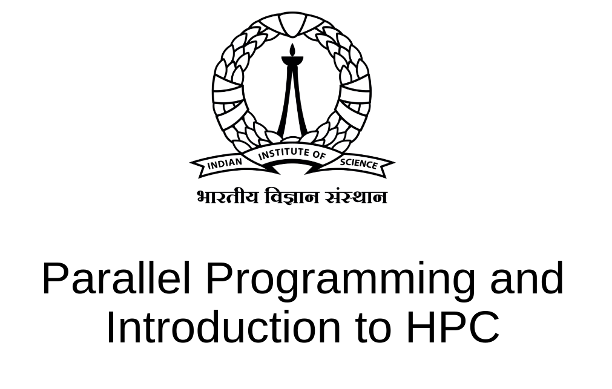

# Online Course Parallel Programming and Introduction to High-Performance Computing 

## Course Description   

This course is an introduction to parallel programming and high-performance computing (HPC). The course will cover the basic concepts of parallel programming, including parallel algorithms, parallel architectures, programming models for parallel computing, and parallel programming paradigms. 

Instructor: [Dr. Yoginder Kumar Negi](https://yknegi.github.io/)

